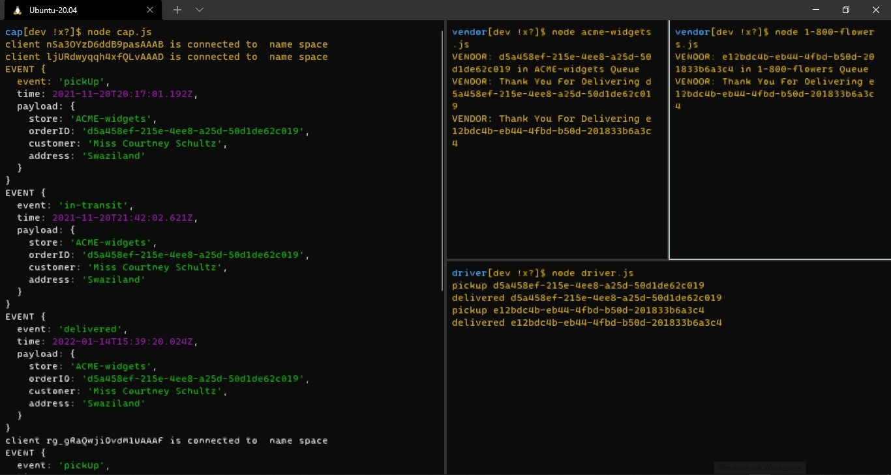
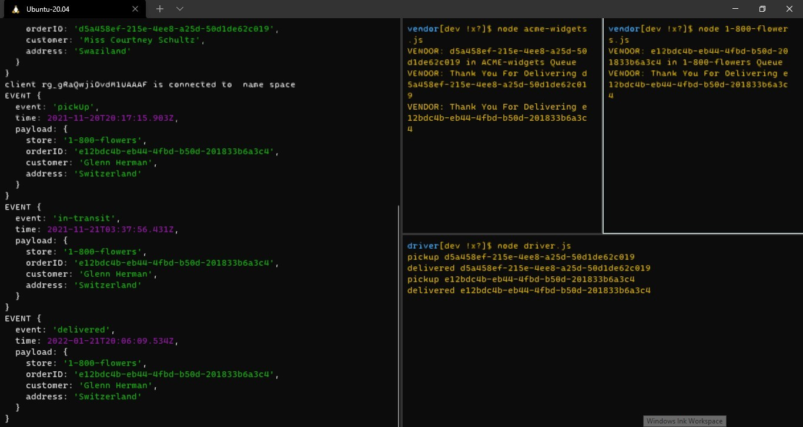
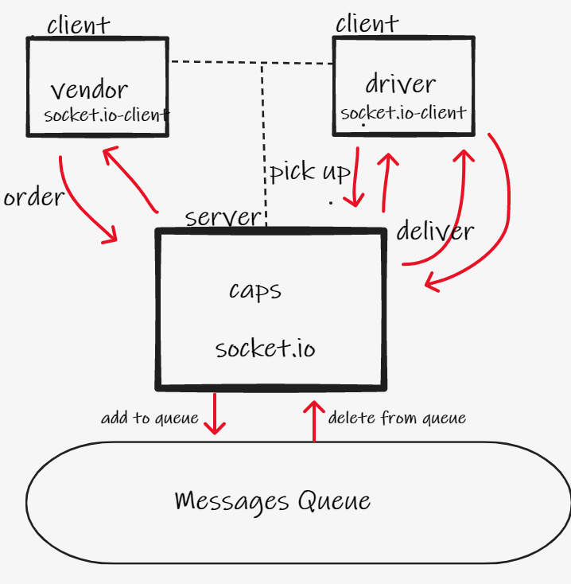

# caps-queue

## description:
- a delivery notification system using socket.io; real time notification system. Using queues to store messages.
## features:
- faker
- socket.io
- jest
- Queue
## Outputs:

## UML:

## test:
- node caps.js
- node driver.js
- node node 1-800-flowers.js
- after close the server and the client:- npm test